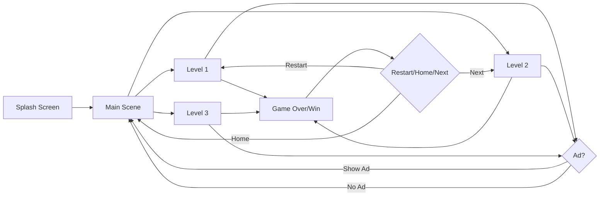
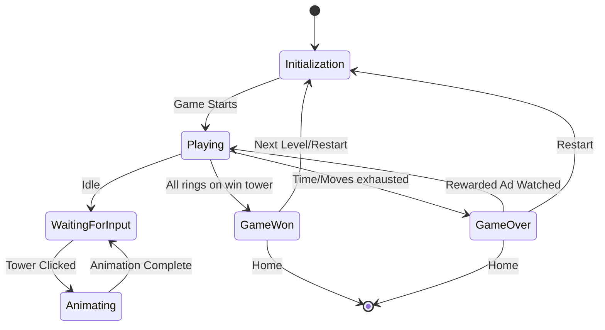
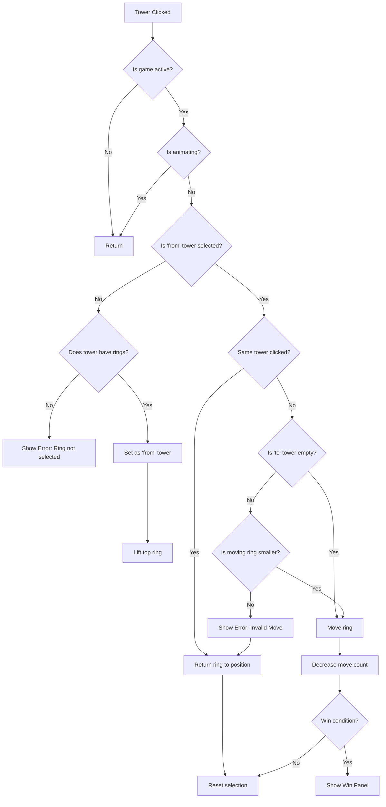

# Tower of Hanoi - Game Flow Documentation

## Table of Contents
1. [Overview](#overview)
2. [Game Architecture](#game-architecture)
3. [Scene Flow](#scene-flow)
4. [Game States](#game-states)
5. [Core Gameplay Mechanics](#core-gameplay-mechanics)
6. [System Components](#system-components)
7. [User Interactions](#user-interactions)
8. [Win/Lose Conditions](#winlose-conditions)

---

## Overview

This is a Unity-based implementation of the classic Tower of Hanoi puzzle game. The game features multiple difficulty levels, time and move constraints, sound effects, and advertisement integration.

**Key Features:**
- Multiple levels (Level 1, 2, 3)
- Time-based gameplay (60 seconds per level)
- Move-limited gameplay
- Sound effects and background music
- Rewarded ads for continues
- Interstitial ads between scenes

---

## Game Architecture

### Core Scripts

| Script | Purpose |
|--------|---------|
| **GameManager.cs** | Main gameplay controller, handles game logic, moves, timing, win/lose conditions |
| **MainScript.cs** | Main menu controller, handles scene loading, level selection, sound settings |
| **Ring.cs** | Represents individual ring objects with size property |
| **Tower.cs** | Represents tower objects, manages ring stacks, handles click detection |
| **SoundManager.cs** | Singleton for managing audio (SFX and background music) |
| **AdsManager.cs** | Handles ad loading and display (interstitial and rewarded) |

---

## Scene Flow



### Scene Descriptions

#### 1. Main Scene (Scene 0)
**Purpose:** Main menu and level selection

**Components:**
- Level selection buttons (Level 1, 2, 3)
- Sound settings (SFX and Background music sliders)
- Loading panel with progress slider

**Flow:**
1. User arrives at main scene
2. Sound settings are loaded from PlayerPrefs
3. User selects a level
4. Level number saved to `PlayerPrefs["Current scene"]`
5. Interstitial ad may show (if loaded)
6. Loading animation plays
7. Selected level scene loads

#### 2. Level Scenes (Scene 1, 2, 3)
**Purpose:** Gameplay

**Components:**
- Towers (3 towers: start, middle, end)
- Rings (varying count based on level)
- UI displays: Timer, Move counter, Error messages
- Game over/Game win panels
- Restart/Home/Next buttons

---

## Game States



### State Details

| State | Description | Triggers |
|-------|-------------|----------|
| **Initialization** | Game setup, rings placed on first tower | Scene loaded |
| **Playing** | Active gameplay, timer running | Game starts |
| **WaitingForInput** | Awaiting user tower click | `Isanimate = false` |
| **Animating** | Ring movement animation in progress | Tower clicked, valid move |
| **GameWon** | All rings successfully moved to win tower | `WinTower.Ringstack.Count == rings.Length` |
| **GameOver** | Time or moves depleted | `Gametime <= 0` OR `Moves == 0` |

---

## Core Gameplay Mechanics

### Game Initialization

**On Start:**
1. Set target framerate to 60 FPS
2. Initialize loading slider
3. Push all rings onto first tower (`t1`) in order
4. Set `IsGameStart = true`
5. Start timer coroutine
6. Display initial move count

### Tower Click System

The tower click system implements the classic Tower of Hanoi rules:



### Move Validation Rules

1. **Ring Selection:**
   - Only the top ring of a tower can be selected
   - Cannot select from an empty tower

2. **Ring Placement:**
   - Can place on empty tower
   - Can only place smaller ring on top of larger ring
   - Cannot place larger ring on top of smaller ring

3. **Invalid Move Handling:**
   - Ring returns to original position
   - Error message displayed
   - Error sound plays
   - No move deducted

### Animation System

**Ring Movement Animation (using DOTween):**
1. **Lift Phase:** Ring moves up 3 units (0.5s duration)
2. **Horizontal Phase:** Ring moves to target tower X position (0.5s duration)
3. **Drop Phase:** Ring moves down to stack position (0.5s duration)

**Animation Blocking:**
- `Isanimate` flag prevents input during animations
- Ensures only one ring moves at a time
- Prevents stack corruption

### Timing System

**Timer Coroutine:**
- Runs every second (`WaitForSecondsRealtime(1)`)
- Decrements `Gametime` from 60 to 0
- Updates displayed time
- Checks for game over conditions
- Stops when game ends or time reaches 0

### Move Counting

**Move System:**
- Each successful ring placement decrements move counter
- Invalid moves don't count
- Canceled moves (clicking same tower) don't count
- Move count displayed in real-time

---

## System Components

### Sound Manager

**Singleton Pattern:**
- Persists across scenes (`DontDestroyOnLoad`)
- Manages two audio sources: SFX and Background music

**Sound Events:**
| Event | Sound Name | Trigger |
|-------|----------|---------|
| Tower click | "Click" | Any tower clicked |
| Invalid move | "Error" | Rule violation |
| Game win | "Win" | All rings on win tower |

**Volume Control:**
- SFX volume controlled by slider
- Background music volume controlled by slider
- Settings persist in PlayerPrefs

### Ads Manager

**Ad Types:**
1. **Interstitial Ads:**
   - Shown between level selections
   - Optional (only if loaded)
   - Callback triggers scene loading

2. **Rewarded Ads:**
   - Shown on game over screen
   - Grants continues (extra moves/time)
   - User-initiated via button

**Reward System:**
- If both moves and time are 0: +5 moves, +30 seconds
- If only moves are 0: +5 moves
- If only time is -1: +30 seconds
- Game resumes after reward

---

## User Interactions

### Main Menu Interactions

| Action | Input | Result |
|--------|-------|--------|
| Select Level | Click level button | Save level to PlayerPrefs, show ad (optional), load level |
| Adjust SFX Volume | Slide SFX slider | Update SFX volume in real-time |
| Adjust BG Volume | Slide BG slider | Update background music volume |

### Gameplay Interactions

| Action | Input | Result |
|--------|-------|--------|
| Select Ring | Click tower with rings | Top ring lifts, tower marked as 'from' |
| Place Ring | Click different tower | Ring moves if valid, error if invalid |
| Cancel Selection | Click same tower | Ring returns to position |
| Restart Level | Click restart button | Reload current level scene |
| Go to Home | Click home button | Load main menu (scene 0) |
| Next Level | Click next (on win) | Load next level scene |
| Watch Ad (Game Over) | Click continue button | Show rewarded ad, grant extra resources |

### Input Handling

**Desktop:**
- Mouse clicks on towers using `OnMouseDown()`

**Mobile:**
- Touch input via Unity's touch system
- Vibration feedback on moves (optional, currently commented out)

**Keyboard:**
- ESC key returns to main menu

---

## Win/Lose Conditions

### Win Condition

**Trigger:** All rings successfully stacked on the win tower

**Validation:**
```csharp
if (WinTower.Ringstack.Count == rings.Length)
```

**Actions:**
1. Set `IsGameStart = false` (stops timer)
2. Display "Game Win" panel
3. Play "Win" sound effect
4. Show options: Restart, Home, Next Level

### Lose Conditions

#### 1. Time Expired
**Trigger:** `Gametime <= 0`

**Display:** "Time is over"

#### 2. Moves Exhausted
**Trigger:** `Moves == 0`

**Display:** "Moves are over"

**Common Game Over Actions:**
1. Set `IsGameStart = false` (stops timer)
2. Display "Game Over" panel
3. Show "Continue" button (if rewarded ad available)
4. Show options: Restart, Home

### Continue System

**Availability:** Based on rewarded ad loading status

**Rewards:**
- +5 moves (if moves depleted)
- +30 seconds (if time depleted)
- Game state reset to playing
- Timer resumes

---

## Data Flow

### PlayerPrefs Usage

| Key | Type | Purpose |
|-----|------|---------|
| "Current scene" | int | Stores selected level (1, 2, or 3) |
| "SFX" | float | Sound effects volume (0-1) |
| "BG" | float | Background music volume (0-1) |

### Scene Loading

**Loading Process:**
1. Display loading panel
2. Animate loading slider (0 to 2 over time)
3. Once complete, load target scene
4. Loading slider uses `Time.deltaTime` for smooth animation

---

## Error Handling

### Error Messages

| Error | Trigger | Display Time |
|-------|---------|--------------|
| "Ring is not selected" | Click empty tower as first action | 1 second |
| "Invalid Move! Cannot place a larger ring on top of a smaller ring" | Violate size rule | 2 seconds |

### Error Animation

- Text uses `DOLocalJump` animation
- Bouncing effect (10 units, 10 jumps)
- Auto-clears after duration

---

## Technical Notes

### Dependencies

- **DOTween:** Tween animation library for smooth movements
- **TextMeshPro:** Enhanced text rendering
- **Unity Scene Management:** Scene transitions
- **Unity Input System:** Input handling (optional, file present)

### Performance Optimizations

- Target framerate locked at 60 FPS
- Animation blocking prevents simultaneous movements
- Efficient stack data structure for ring management
- Sound manager singleton prevents duplicate instances

### Design Patterns

1. **Singleton Pattern:** SoundManager persists across scenes
2. **Stack Data Structure:** Tower ring management
3. **Coroutines:** Async operations (timing, animations, loading)
4. **Event Callbacks:** Ad completion triggers
5. **State Machine:** Game state management

---

## Future Enhancement Opportunities

1. **Difficulty Scaling:** More rings in higher levels
2. **Score System:** Based on time remaining and moves used
3. **Leaderboards:** Track best times/moves
4. **Tutorial Mode:** Interactive guide for new players
5. **Visual Themes:** Different tower and ring skins
6. **Undo System:** Allow move reversal
7. **Hint System:** Suggest optimal next move
8. **Save System:** Resume interrupted games

---

*Documentation generated on 2026-01-10*
